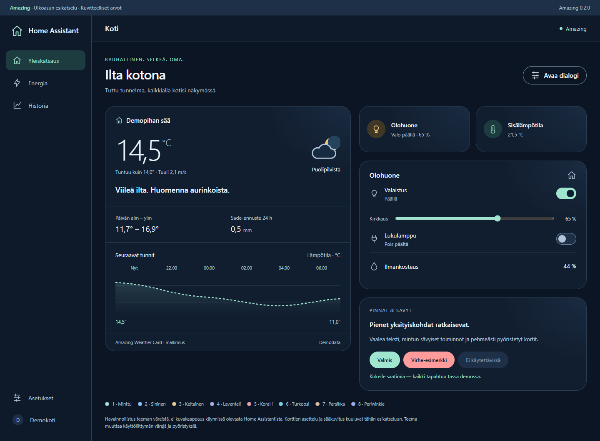

# Amazing Theme

Syvä laivastonsininen Home Assistant -teema, jonka minttu, sateensininen ja lämmin keltainen ovat peräisin **Amazing Weather Cardin alkuperäisestä tummasta ulkoasusta**. Korttipinnat ovat `#111e30` hillityllä sinisellä kulmahehkulla, teksti `#eef5fc` ja pyöristykset 24 px.

**Versio 0.2.0 · HACS-yhteensopiva · Vain tumma tila.** Julkinen repositorio: [raunosr/ha-amazing-theme](https://github.com/raunosr/ha-amazing-theme). Asenna HACS:n mukautettuna repositoriona; teema ei ole HACS:n oletusluettelossa.

[](https://github.com/raunosr/ha-amazing-theme/actions/workflows/validate.yaml)
[](https://my.home-assistant.io/redirect/hacs_repository/?owner=raunosr&repository=ha-amazing-theme&category=theme)



*Kuva on version 0.2.0 mukana toimitetusta esikatselusta, ei käynnissä olevasta Home Assistantista. Esimerkkitiedot ovat kuvitteellisia. Teema ei luo kuvan dashboard-asettelua tai sääkorttia.*

## Mitä saat

- Itsenäinen `themes/amazing.yaml`: värit, kortit, sivupalkki, syötekentät, valitsimet ja dialogipinnat.
- Hillitty, paikallaan pysyvä 8 %:n sininen hehku kortin oikeassa yläkulmassa ja kahdeksan värin kaaviopaletti. [Ulkoasun asetukset ja kaavioesimerkit](docs/APPEARANCE.md).
- Vanhempien MDC-komponenttien sekä nykyisten HA-komponenttien väriasetukset.
- Home Assistantin omat fontit, asettelut ja säätimien mitat. Ei card-modia, JavaScript-resurssia, fonttilatauksia tai kuvataustoja.
- Profiilissa koko käyttöliittymälle valittava teema sekä näkymäkohtainen käyttö.
- Offline-esikatselu ja kuvakaappaukset. Kytkimet ja dialogi toimivat vain demossa.

## Asenna käsin

1. Kopioi **vain** `themes/amazing.yaml` Home Assistantin asetushakemistoon polkuun `themes/amazing/amazing.yaml`. Asetushakemisto tarkoittaa hakemistoa, jossa `configuration.yaml` sijaitsee; monissa asennuksissa se on `/config`.
2. Yhdistä seuraava olemassa olevaan `frontend:`-lohkoon. Älä luo toista samannimistä lohkoa. Jos teemoja ladataan jo muulla `!include`-järjestelyllä, säilytä myös nykyiset teemat.

   ```yaml
   frontend:
     themes: !include_dir_merge_named themes
   ```

3. Jos muutit `configuration.yaml`-tiedostoa, tarkista kokoonpano ja käynnistä HA uudelleen. Jos teemoja ladattiin jo tästä hakemistosta, riittää **Kehittäjätyökalut → Toiminnot → `frontend.reload_themes`**.
4. Valitse teema alla kuvatulla tavalla. Tarvittaessa päivitä selain tai avaa Companion-sovelluksen näkymä uudelleen.

Hakemistolataus vastaa [HACS:n teema-asennusohjetta](https://www.hacs.xyz/docs/use/repositories/type/theme/). Tiedosto `examples/configuration.yaml` sisältää saman asetusesimerkin. Älä kopioi esimerkkitiedostoja `themes`-hakemistoon.

## Valitse koko käyttöliittymälle

Avaa oma käyttäjäprofiili sivupalkin alareunasta ja valitse **Teema → Amazing**. Tämä käyttää tummaa tilaa ja kattaa myös sovelluksen navigoinnin ja asetussivut. Valinta koskee käyttäjäprofiiliasi. Palauta aiempi teema tai Home Assistantin oletusteema samasta valikosta.

Paketti ei aseta järjestelmän oletusteemaa. Profiilivalinta ja teemojen uudelleenlataus on kuvattu [Home Assistantin frontend-ohjeessa](https://www.home-assistant.io/integrations/frontend/).

## Valitse vain yhdelle dashboard-näkymälle

Valitse muokattavan dashboardin näkymän asetuksissa teemaksi **Amazing**, tai lisää näkymän YAML-objektiin:

```yaml
title: Koti
path: koti
theme: Amazing
```

Säilytä näkymän nykyiset `cards`- tai `sections`-määritykset. `theme` kuuluu näkymään, ei koko dashboardin juureen. [HA:n virallinen näkymäohje](https://www.home-assistant.io/dashboards/views/#theme).

Näkymävalinta koskee näkymää ja sen kortteja. Sivupalkki, asetussivut ja osa sovelluksen juureen avautuvista dialogeista voivat seurata profiiliteemaa. Käytä profiilivalintaa, kun haluat saman ilmeen kaikkialle. Tumman teeman valinta näkymälle ei edellytä yleisen teeman vaihtamista.

`examples/dashboard.yaml` on kokonainen, **uuteen manuaaliseen dashboardiin** tarkoitettu demo. Siinä on pelkkiä natiiveja Markdown-kortteja ilman entiteettejä tai palvelukutsuja. `examples/native-cards.yaml` sisältää valinnaisia laitekortteja: korvaa kaikki `_replace_me`-entiteetit omilla tunnuksillasi ennen käyttöä. Älä korvaa olemassa olevaa dashboardia demoasetuksilla.

## HACS-asennus

Lisää teema HACS:n mukautettuna repositoriona yllä olevasta painikkeesta tai seuraavasti:

1. Avaa HACS → oikean yläkulman valikko → **Custom repositories / Mukautetut repositoriot**.
2. Syötä `https://github.com/raunosr/ha-amazing-theme` ja valitse tyypiksi **Theme / Teema**.
3. Lisää ja lataa **Amazing Theme**. Ota teemahakemiston lataus käyttöön yllä kuvatusti, lataa teemat uudelleen ja valitse Amazing.

HACS asentaa teematiedoston `themes/`-hakemiston alle ja seuraa GitHub-julkaisuja. ZIP-paketti on vaihtoehto käsin asentamiseen. [HACS: Custom repositories](https://www.hacs.xyz/docs/faq/custom_repositories/), [HACS: yleiset vaatimukset](https://www.hacs.xyz/docs/publish/start/).

### Päivitä HACS:ssa

Avaa Amazing Theme HACS:ssa ja lataa uusi versio. Jos päivitys ei vielä näy, valitse repositorion valikosta **Update information / Päivitä tiedot**. Suorita `frontend.reload_themes` ja päivitä selain. Teeman nimi säilyy `Amazing`, joten näkymän valintaa ei tarvitse vaihtaa. Säilytä omat muutokset erillisessä, eri nimisessä teemassa.

## Esikatselu

Avaa [preview/index.html](preview/index.html) paikallisessa selaimessa. Verkkoyhteyttä tai Home Assistant -kirjautumista ei tarvita. Kokeile valaistuskytkimiä, kirkkaussäädintä ja **Avaa dialogi** -painiketta.

Kuvat ja HTML-esikatselu käyttävät version 0.2.0 teematiedostoa.

| Työpöytä | Dialogi | Puhelin |
| --- | --- | --- |
| [Kuva](docs/screenshots/desktop.png) | [Kuva](docs/screenshots/dialog.png) | [Kuva](docs/screenshots/mobile.png) |

## Yhteensopivuus ja tarkistukset

YAML, HACS-paketin paikallinen rakenne ja 103 väriparin kontrastit on tarkistettu. Esikatselu on testattu viidellä leveydellä 320–1440 px. GitHubin HACS- ja teemavalidointi ovat läpäisseet tarkistukset.

**Amazing 0.2.0:n julkaisuehdokas testattiin 8.9.2026 Home Assistant Core 2026.8.3:ssa.** Testissä käytettiin Amazing Weather Card 0.2.1:tä sekä natiiveja historia-, tilasto-, sensori-, painike-, Tile- ja Markdown-kortteja. Hehku, käyrien sarjavalinta, keltainen pylväskaavio, sääkortin ennustejakson vaihto ja painikkeen more-info-dialogi tarkistettiin selaimessa. [Testiympäristö, asennustapa ja rajaukset](docs/COMPATIBILITY.md#suora-ha-testi-892026).

Home Assistantin sisäiset tyylimuuttujat voivat muuttua. Kolmannen osapuolen kortti, joka määrittelee värinsä itse, voi ohittaa teeman. Teema ei vaadi Amazing Weather Cardia eikä muuta sen ohjelmakoodia. Amazing 0.2.0 tuo hillityn hehkun myös teemataustaa käyttäviin kortteihin. Sääkortin pakotettu tumma tai vaalea tila voi käyttää omaa taustaa; testissä käytettiin `theme: auto` -asetusta. [Hehkun ja kaaviovärien rajaukset](docs/APPEARANCE.md).

Lisätiedot: [yhteensopivuus ja HA-kokeilun lista](docs/COMPATIBILITY.md), [kontrastiraportti](docs/VALIDATION.md), [esikatselun testit](docs/PREVIEW-QA.md).

## Muokkaus ja julkaiseminen

Teeman lähde on `themes/amazing.yaml`. Älä muokkaa HACS:n hallitsemaa kopiota pysyvästi, koska päivitys voi korvata sen. Omia värejä varten luo erillinen tiedosto ja vaihda myös teeman nimi.

Kehitystyökalut tarvitsevat Node.js:n; itse HA-teema ei tarvitse sitä:

```sh
npm ci --ignore-scripts
npm run preview:build
npm run validate
```

Esikatselun käyttöliittymävärit generoidaan samasta YAML:sta. Sääkuvitus on erillinen, esikatselulle piirretty elementti. Muutosten jälkeen päivitä myös kuvakaappaukset selaimesta. [Julkaiseminen](docs/RELEASING.md), [osallistuminen](CONTRIBUTING.md), [tietoturva](SECURITY.md).

## Alkuperä ja lisenssi

Väripaletti ja 24 px:n korttipyöristys perustuvat [Amazing Weather Card v0.1.0:n](https://github.com/raunosr/ha-amazing-weather-card/releases/tag/v0.1.0) `src/styles.ts`-tiedostoon. Tässä paketissa ei ole sääkortin ohjelmakoodia eikä käyttäjän HA-konfiguraatiota. Lisenssi: [MIT](LICENSE).

*English: A standalone dark Home Assistant theme with navy surfaces and mint accents. In HACS, add `https://github.com/raunosr/ha-amazing-theme` as a custom repository of type **Theme**, then download Amazing Theme. Enable the frontend theme loader shown above, reload themes, and select **Amazing** in your profile or set `theme: Amazing` on a dashboard view. The 0.2.0 release candidate was tested in Home Assistant Core 2026.8.3 with Amazing Weather Card 0.2.1 and native history, statistics, sensor, button, tile and Markdown cards. The theme adds a subtle 8% blue corner glow and eight chart series colors. See the compatibility report for the installation method and test limits. Bundled screenshots show the 0.2.0 offline preview with fictional data.*
